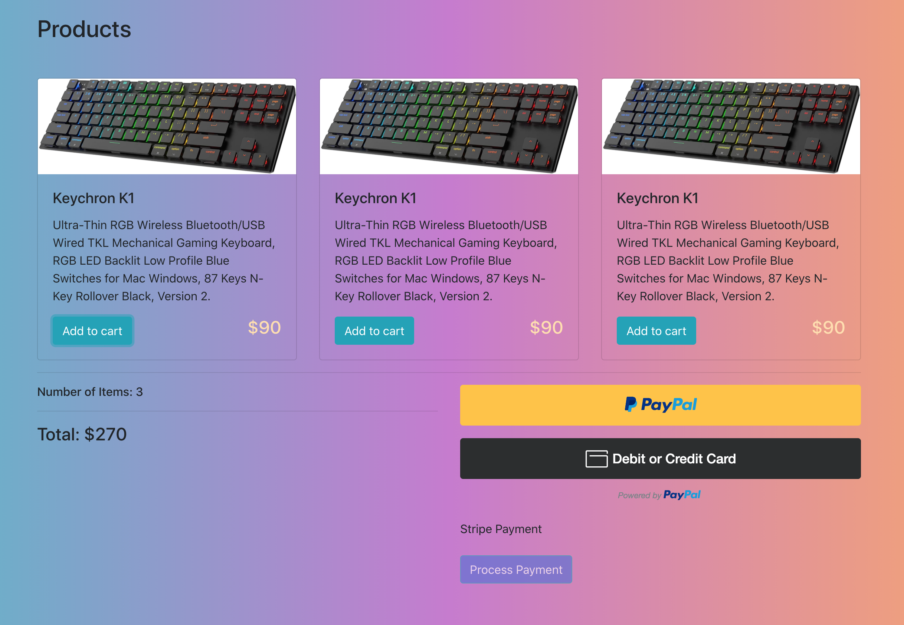
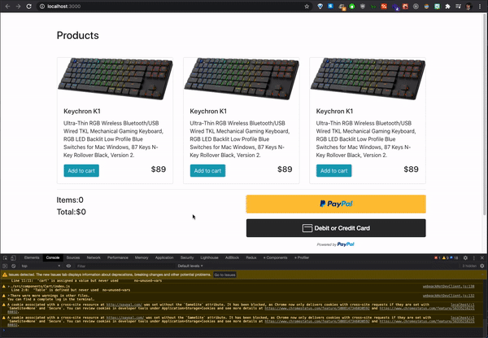
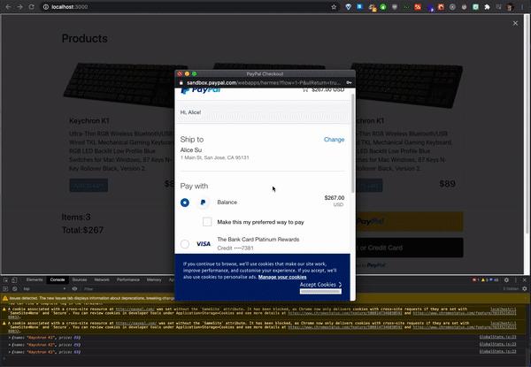
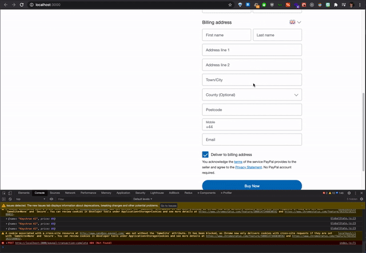

# Rapid POC Development of Full Stack eCommerce app, showcasing Paypal and Stripe API integration for development sandbox testing purposes

Tech Stack:
> React, ContextAPI, Express, NodeJS, Stripe, PayPal, Bootstrap

 

## Live test url: https://payment-apis.herokuapp.com/

 

## Test PayPal with:
email: `femexeg602@mail7d.com`

pw: `test1290`

 

## Test Stripe with:
cc num: `4242 4242 4242 4242`

exp: `12/25`

ccv: `888`

zip: `55555`

 

## Demo:

 

## Future Features:

- [ ] Square API 
- [ ] Google Pay 
- [ ] Apple Pay 
- [ ] AfterPay
- [ ] Zip pay

